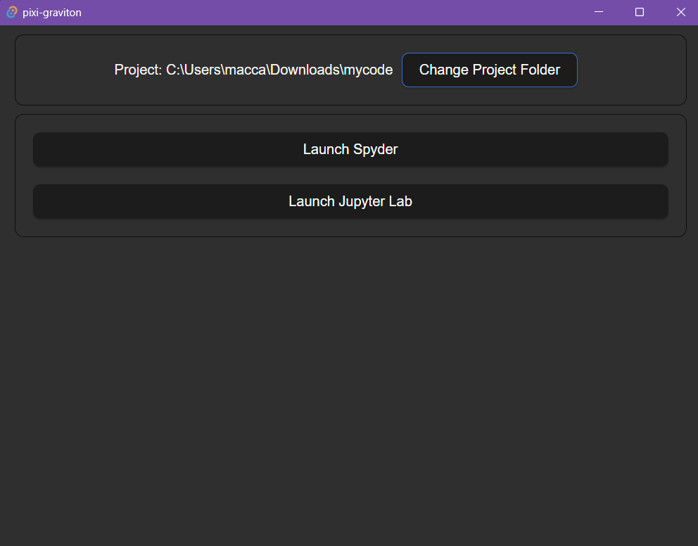

# Pixi Graviton

Pixi Graviton is a user-friendly UI for Pixi that sets up a basic environment in a folder and installs Jupyter Lab and Spyder. Inspired by Anaconda Navigator, Pixi Graviton allows users to interact with the UI without needing to touch the command line. 



## Features

- **No Command Line Required**: Install Pixi Graviton from the releases, run it, and interact with the UI.
- **Automatic Python Installation**: Pixi Graviton can install Python if it's not already installed.
- **Launch Jupyter Lab and Spyder**: Easily start Jupyter Lab or Spyder from the UI buttons.
- **Future Expansion**: Potential to add more tools in the future.
- **Cross-Platform**: Runs on both Windows and macOS.

## Installation

1. Download the latest release of Pixi Graviton.
2. Run the installer and follow the on-screen instructions.

## Usage

1. Open Pixi Graviton.
2. Use the UI to set up your environment and install Jupyter Lab and Spyder.
3. Launch Jupyter Lab or Spyder directly from the UI.

## Folder Structure

When you set up an environment, Pixi Graviton creates a folder with the following structure:

```
your-project-folder/
├── pixi.toml
```

The `pixi.toml` file contains the dependencies and tasks to start Jupyter Lab or Spyder from the buttons.